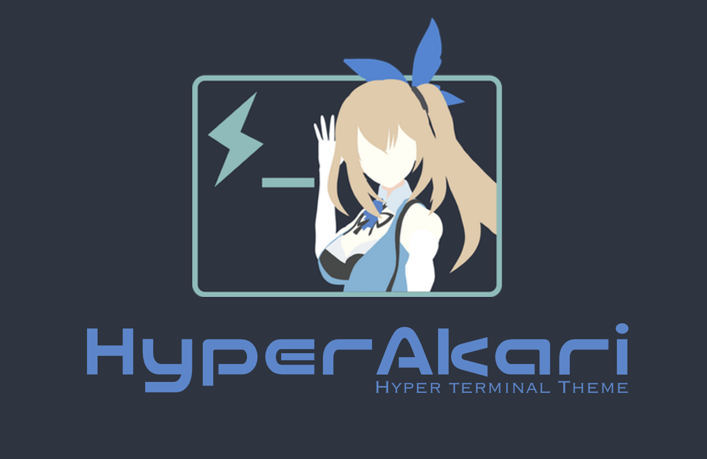
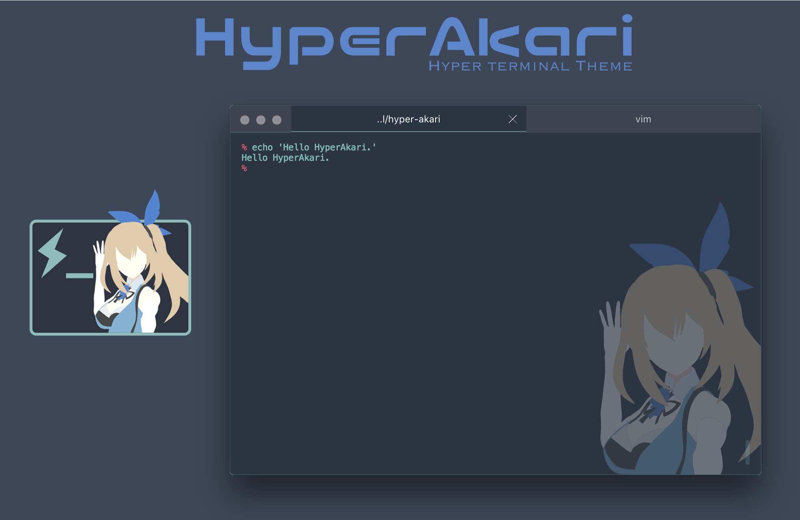
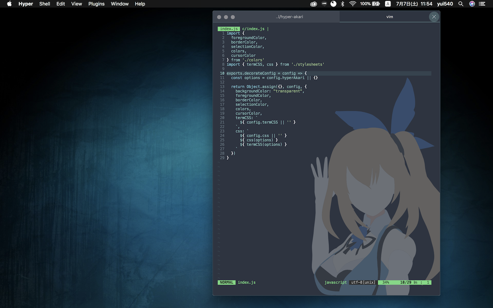
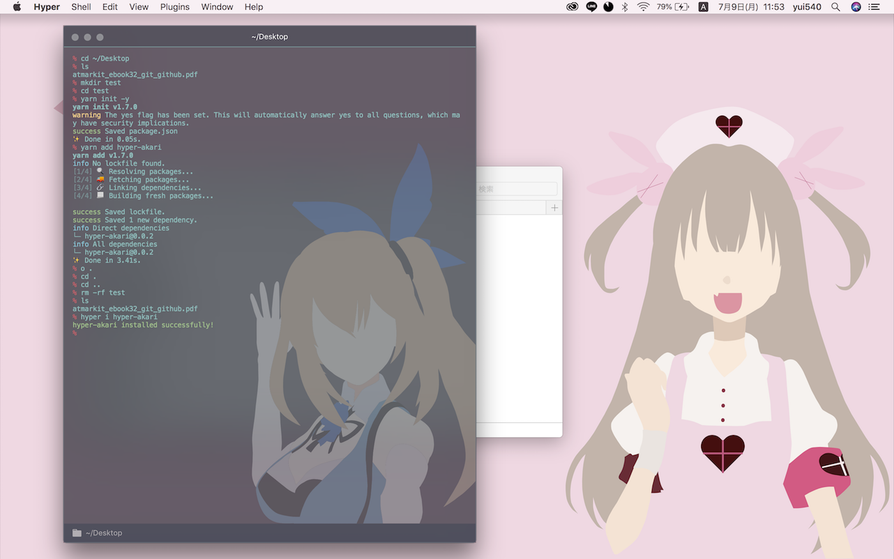

# HyperAkari



[English README](README.en.md)

HyperAkariは、ターミナルエミュレータ「Hyper」のテーマプラグインです。

青をメインにした色合いになっています。





## 使い方

```bash
$ hyper i hyper-akari
```

## オプション

```js:.hyper.js
config: {
  // ...
  hyperAkari: {
    illust: true, // イラストを表示するか（デフォルトは true）
    opacity: 0.3, // イラストの不透明度0~1（デフォルトは0.3）
    vibrancy: 'dark', // オープン動的効果 (デフォルトは dark)
    vibrancyOpacity: 0.7, // ダイナミックエフェクトの透明度 0~1 (デフォルトは 0.7)
  },
  // ...
}
```
